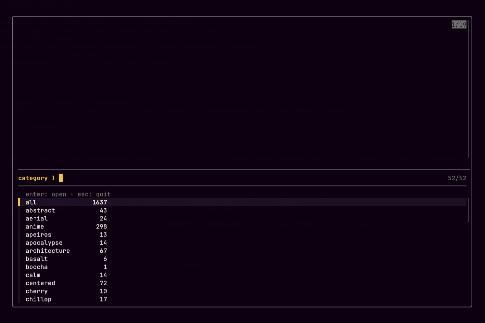
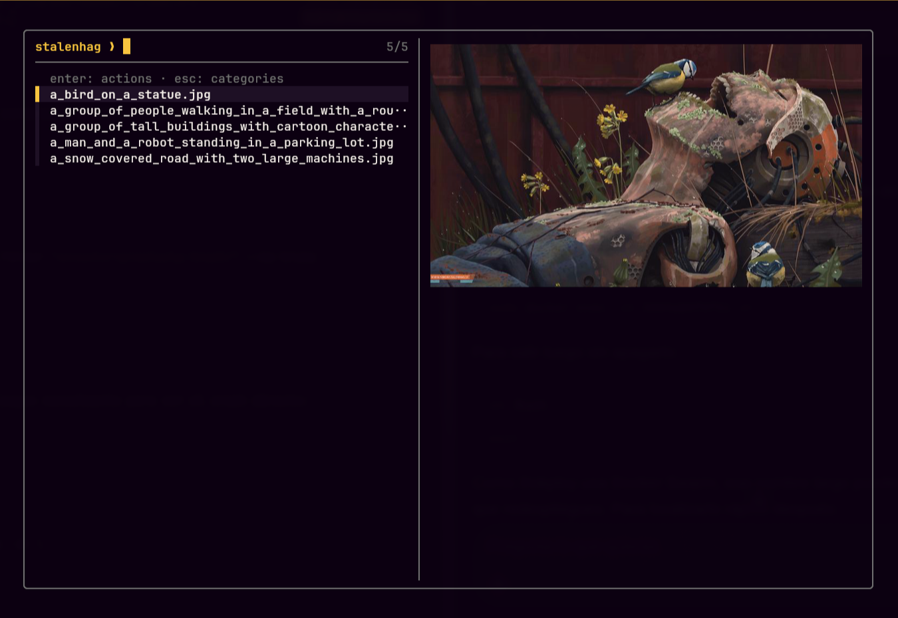
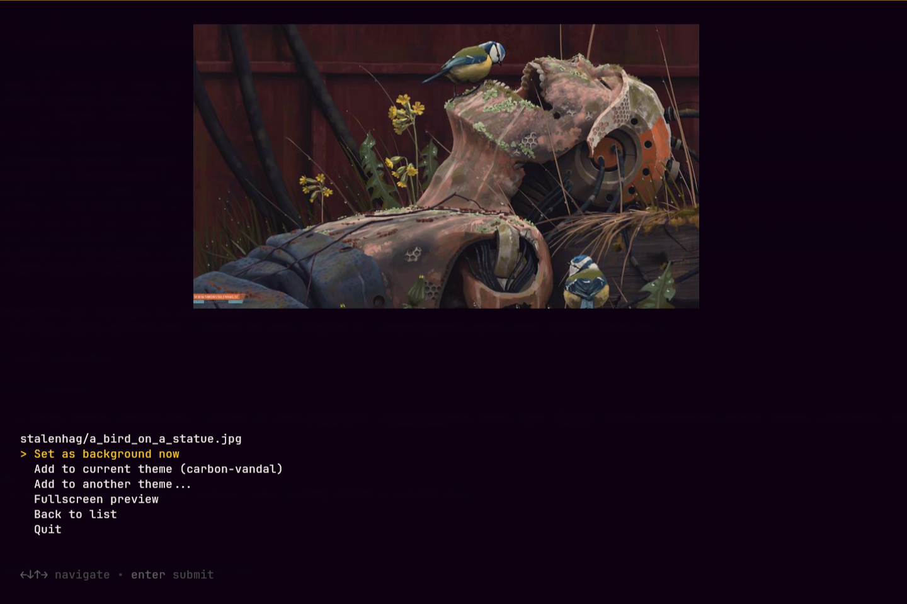

<div align="center">
  <br />
  <h1><code>./OMARCHY_WALLS.sh</code></h1>

**1,637 CURATED WALLPAPERS. ZERO CLONES. ONE KEYBIND.**
<br />

[](https://github.com/samuhlo/omarchy-walls)

[](LICENSE)

  <br />
</div>

___

## // 00_ THE_MISSION

**omarchy-walls** is a wallpaper browser for [Omarchy](https://omarchy.org/). It streams
the [dharmx/walls](https://github.com/dharmx/walls) collection — 1,637 images across 51
categories — into a floating terminal: fuzzy-search a category, watch live previews render
next to the list, hit enter and the wallpaper lands in your theme. Set it as the active
background on the spot, or just add it to the rotation of any installed theme.

The catch: that collection weighs **3.7 GB**. This tool never clones it. One call to the
GitHub Trees API builds a local index, thumbnails arrive through an image-resize proxy at
~12 KB each, and only the wallpapers you actually install get downloaded at full size.

> _note: the first design used Walker for the whole UI, like every other Omarchy menu.
> Reading Walker's source killed that plan — its dmenu mode parses stdin into plain text,
> no icon field, no images. The pivot to fzf + kitty graphics turned out better than the
> original: a live full-color preview beats a 40px icon in a list._

<div align="center">
  
  
  
</div>

___

## // 01_ INSTALL

One line, no clone:

```bash
curl -fsSL https://raw.githubusercontent.com/samuhlo/omarchy-walls/main/install.sh | bash
```

Or from a checkout:

```bash
git clone https://github.com/samuhlo/omarchy-walls
cd omarchy-walls
./install.sh
```

The installer copies the binary to `~/.local/bin`, binds `SUPER + ALT + W` in Hyprland
(only if the combo is free — it never steals your keys), and hooks a
**󰍉 Browse walls collection** entry into Omarchy's own background selector
(`SUPER + ALT + SPACE` → Style → Background), previewed with a magnifier cover
drawn in your theme's accent tone. Re-running it is safe; it is how you update.

The UI inherits whatever theme you run: fzf reads the palette from the active
theme's `colors.toml`, gum picks up Omarchy's session-wide styling, and the
kitty window is themed by your own config. Switch themes and everything —
cover included — follows.

Dependencies — all stock on Omarchy: `jq`, `curl`, `fzf`, `gum`, `kitty`, `imv`.

___

## // 02_ THE_BLUEPRINT

| LAYER           | TECH                       | IMPLEMENTATION DETAIL                                              |
| :-------------- | :------------------------- | :----------------------------------------------------------------- |
| **Core**        | `bash`                     | Single self-contained script, no daemon, no state beyond cache.     |
| **Index**       | `GitHub Trees API` + `jq`  | One request indexes 1,637 files; refreshed weekly, stale-safe.      |
| **Thumbnails**  | `weserv` proxy + `magick`  | ~12 KB previews via resize proxy; ImageMagick fallback if it dies.  |
| **UI**          | `fzf` + `gum` + `kitten icat` | Category → list → actions, live image previews, Esc walks back.  |
| **Integration** | `omarchy theme bg` + `Hyprland` | Installs into `~/.config/omarchy/backgrounds/<theme>/`.       |

___

## // 03_ CONTROLLED_CHAOS (KEY FEATURES)

- **Category-first navigation:** the picker opens on 51 categories (plus `all`), each one
  previewed with a random wallpaper from its own pool — you see the vibe before you enter.
- **Streaming a 3.7 GB repo through a straw:** index once, thumbnail on hover, download
  full-size only on install. A full browsing session costs a few hundred KB.
- **Native theme plumbing:** installed wallpapers drop into the exact folder
  `omarchy theme bg next` cycles through, prefixed by category to dodge collisions.
  `--set` flips the active background through Omarchy's own command, nothing bypassed.

___

## // 04_ CORE_LOGIC (SNIPPET)

The thumbnail cascade — the reason browsing feels instant on a collection that would
otherwise pull megabytes per keystroke. FAIL CLOSED at every step: proxy dies, ImageMagick
takes over; both die, the full image is still a valid answer.

```bash
# omarchy-walls · cmd_thumb
local proxy_url="$RESIZE_PROXY?url=$(jq -rn --arg u "raw.githubusercontent.com/$REPO/$BRANCH/$path" '$u | @uri')&w=$THUMB_WIDTH&output=jpg&q=75"
if curl -fsSL --retry 1 --connect-timeout 5 "$proxy_url" -o "$dest.tmp" 2>/dev/null; then
  mv "$dest.tmp" "$dest"; echo "$dest"; return 0
fi

if command -v magick >/dev/null; then
  full=$(cmd_get "$path") || exit 1
  magick "$full" -resize "${THUMB_WIDTH}x" "$dest" 2>/dev/null && { echo "$dest"; return 0; }
fi

# Last resort: the full image works as an (oversized) thumbnail
cmd_get "$path"
```

___

## // 05_ FIELD_MANUAL

| COMMAND                                  | EFFECT                                              |
| :--------------------------------------- | :-------------------------------------------------- |
| `omarchy-walls menu`                      | Floating browser window (what the keybind runs).    |
| `omarchy-walls browse [category]`         | Same browser, current terminal, optional jump.      |
| `omarchy-walls list [category]`           | Categories with counts, or files inside one.        |
| `omarchy-walls install <cat>/<file> --set`| Add to current theme and set as background now.     |
| `omarchy-walls install <cat>/<file> --theme <name>` | Add to any installed theme's rotation.    |
| `omarchy-walls index --force`             | Refresh the wallpaper index before its weekly TTL.  |
| `omarchy-walls integrate`                 | (Re)add the entry in Style → Background.            |
| `omarchy-walls unintegrate`               | Restore Omarchy's stock background selector.        |
| `omarchy-walls clean`                     | Wipe cache (index, thumbnails, downloads).          |

An Omarchy update can restore the stock selector; `omarchy-walls menu` detects
it and notifies — re-run `omarchy-walls integrate` (or `./install.sh`) to hook
it back.

Set `GITHUB_TOKEN` if you ever hit the anonymous API rate limit. You won't.

The images belong to their respective artists, curated upstream by
[dharmx](https://github.com/dharmx/walls) — this tool downloads on demand and
redistributes nothing.

___

<div align="center">
<br />

<code>DESIGNED & CODED BY <a href='https://github.com/samuhlo'>samuhlo</a></code>

<small>Lugo, Galicia</small>

</div>
